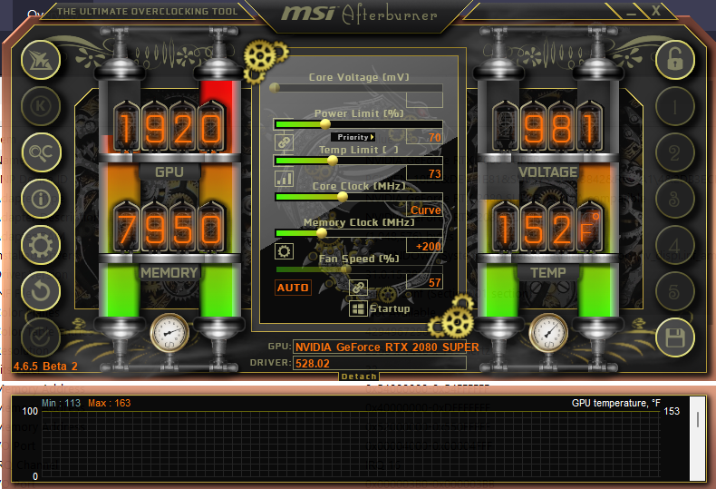
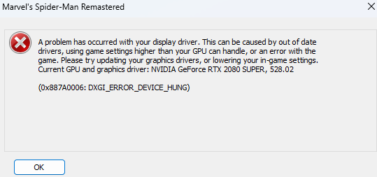
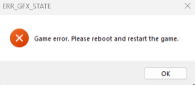

### Summary of Issue(s)

##### A couple of years ago, my PC started crashing about 20-30 minutes into most graphics intense games. I started by Googling those errors, and most suggested that I either needed to update my BIOS or graphics drivers. I've had two motherboards during the duration of this problem, so I assumed it was my graphics drivers for a while.

##### I used NVIDIA GeForce Experience to maintain the latest drivers. I have also attempted to clean uninstall and reinstall those latest drivers manually. Nothing yielded any results. I ended up wiping my PC and upgrading to Windows 11. Then I started to see the LiveKernelEvent Windows Error, and then I was pretty confident this was a hardware issue rather than a hardware issue.

##### I then started troubleshooting possible hardware issues that would result in what I have been experiencing. I found that I was running a single PSU→GPU power cable when that is not good practice. That got me on the Power Consumption issue track, and I found AfterBurner. I used that to cap my overall power consumption, and you can find those details below. I noticed an improvement, so I thought either my GPU wasn't able to receive enough power to play at its peak or my PSU isn't able to supply enough power at its peak. That is when I upgraded my Corsair 850W Gold Tier to my current Corsair 1000W Plat Tier. This also did not fix my issue… I guess this would narrow it down to the GPU not being able to receive that amount of power needed to play, but this is when it was decided to reach out to the community for insight.

---

### Steps Taken

#### Basic Steps

- Replaced Motherboard
- Replaced RAM
- Replaced PSU
- Wiped PC
- Reinstalled Windows
- Upgraded Windows from 10 to 11
- Reinstalled NVIDIA Drivers x100
- Restarted my PC x10000000
- Added GPU power cable (now 2 power cables total)

#### Limited Power Consumption

- Installed MSI Afterburner to limit power consumption. I noticed that I could play games for longer, but consequently there was a major decrease in my FPS.

**MSI AfterBurner Config**

_Note: This snippet was not during a crash instance, but this was my config that resulted in a dip in FPS and ultimately still crashed._

---

### Client Build

- **CPU**: Intel Core i7-8700 3.2 GHz 6-Core Processor
- **CPU Cooling**: Corsair iCUE H115i RGB Pro XT 63 CFM Liquid CPU Cooler
- **MOBO**: Gigabyte Z390 UD ATX LGA1151 Motherboard
- **RAM**: Corsair Vengeance LPX 16 GB (2 x 8 GB) DDR4-3200 CL16 Memory
- **Storage**: Samsung 970 Evo 1 TB M.2-2280 PCIe 3.0 X4 NVME Solid State Drive
- **GPU**: NVIDIA Founders Edition GeForce RTX 2080 SUPER 8 GB Video Card
- **PSU**: Corsair HX1000 Platinum 1000 W 80+ Platinum Certified Fully Modular ATX Power Supply
- **OS**: Microsoft Windows 11 Home OEM - 64-bit

---

### OS Info

- **OS Name**: Microsoft Windows 11 Home
- **Version**: 10.0.22621 Build 22621
- **Other OS Description**: Not Available
- **OS Manufacturer**: Microsoft Corporation

---

### BIOS Info

- **BIOS Version/Date**: American Megatrends Inc. F10, 11/5/2021
- **MBIOS Version**: 3.1
- **Embedded Controller Version**: 255.255
- **BIOS Mode**: UEFI
- **BaseBoard Manufacturer**: Gigabyte Technology Co., Ltd.
- **BaseBoard Product**: Z390 UD
- **BaseBoard Version**: Default string

---

### Display Info

- **Name**: NVIDIA GeForce RTX 2080 SUPER
- **Adapter RAM**: (1,048,576) bytes
- **Driver Version**: 31.0.15.2802
- **Resolution**: 2560 x 1440 x 143 hertz
- **Bits/Pixel**: 32

---

### Disk Info

**Disk 1**

- **Drive**: C:
- **Description**: Disk drive
- **Manufacturer**: (Standard disk drives)
- **Model**: WDC WD10EZEX-22MFCA0
- **Bytes/Sector**: 512
- **Media Loaded**: Yes
- **Media Type**: Fixed hard disk
- **Partitions**: 1
- **SCSI Bus**: 5
- **SCSI Logical Unit**: 0
- **SCSI Port**: 0
- **SCSI Target ID**: 0
- **Sectors/Track**: 63
- **Size**: 931.51 GB (1,000,202,273,280 bytes)
- **File System**: NTFS
- **Size**: 930.58 GB (999,207,997,440 bytes)
- **Free Space**: 96.79 GB (103,930,699,776 bytes)
- **Volume Name**: 1TD M2 SSD - Windows

**Disk 2**

- **Drive**: D:
- **Description**: Disk drive
- **Manufacturer**: (Standard disk drives)
- **Model Samsung**: SSD 970 EVO 1TB
- **Bytes/Sector**: 512
- **Media Loaded**: Yes
- **Media Type**: Fixed hard disk
- **Partitions**: 3
- **SCSI Bus**: 0
- **SCSI Logical Unit**: 0
- **SCSI Port**: 1
- **SCSI Target ID**: 0
- **Sectors/Track**: 63
- **File System**: NTFS
- **Size**: 931.50 GB (1,000,186,310,656 bytes)
- **Free Space**: 758.60 GB (814,545,559,552 bytes)
- **Volume Name**: 1TB HDD

---

### Memory Info

- **Installed Physical Memory (RAM)**: 16.0 GB
- **Total Physical Memory**: 15.9 GB
- **Available Physical Memory**: 7.28 GB
- **Total Virtual Memory**: 22.7 GB
- **Available Virtual Memory**: 7.44 GB

**Overall Status**

- **Motherboard resources**: OK
- **Motherboard resources**: OK
- **Motherboard resources**: OK
- **Motherboard resources**: OK
- **Motherboard resources**: OK
- **Motherboard resources**: OK
- **Motherboard resources**: OK
- **Motherboard resources**: OK
- **High precision event timer**: OK
- **Motherboard resources**: OK
- **Motherboard resources**: OK
- **Motherboard resources**: OK
- **Motherboard resources**: OK
- **Motherboard resources**: OK
- **Motherboard resources**: OK
- **Intel(R) Management Engine Interface #1**: OK
- **PCI Express Root Complex**: OK
- **Intel(R) SPI (flash) Controller - A324**: OK
- **Trusted Platform Module 2.0**: OK
- **Intel(R) Serial IO GPIO Host Controller - INT3450**: OK
- **Intel(R) Serial IO GPIO Host Controller - INT3450**: OK
- **Intel(R) Serial IO GPIO Host Controller - INT3450**: OK
- **Intel(R) Serial IO GPIO Host Controller - INT34- PCI Express Root Compl- Intel(R) Xeon(R) E3 - 1200/1500 v5/6th Gen Intel(R) Core(TM) PCIe Controller (x16) - 19- NVIDIA GeForce RTX 2080 SUPER**: OK
- **PCI Express Root Complex**: OK
- **Intel(R) Xeon(R) E3 - 1200/1500 v5/6th Gen Intel(R) Core(TM) PCIe Controller (x16) - 1901**: OK
- **NVIDIA GeForce RTX 2080 SUPER**: OK
- **NVIDIA USB 3.10 eXtensible Host Controller - 1.10 (Microsoft)**: OK
- **NVIDIA USB 3.10 eXtensible Host Controller - 1.10 (Microsoft)**: OK
- **Intel(R) Xeon(R) E3 - 1200/1500 v5/6th Gen Intel(R) Core(TM) PCIe Controller (x16) - 1901**: OK
- **NVIDIA GeForce RTX 2080 SUPER**: OK
- **NVIDIA GeForce RTX 2080 SUPER**: OK
- **High Definition Audio Controller**: OK
- **NVIDIA USB Type-C Port Policy Controller**: OK
- **High Definition Audio Controller**: OK
- **Standard NVM Express Controller**: OK
- **Intel(R) PCI Express Root Port #9 - A330**: OK
- **Intel(R) PCI Express Root Port #3 - A33A**: OK
- **Realtek Gaming GbE Family Controller**: OK
- **Realtek Gaming GbE Family Controller**: OK
- **Intel(R) USB 3.1 eXtensible Host Controller - 1.10 (Microsoft)**: OK
- **High Definition Audio Controller**: OK
- **Standard SATA AHCI Controller**: OK
- **PCI standard RAM Controller**: OK
- **Intel(R) SMBus - A323**: OK
- **Standard SATA AHCI Controller**: OK
- **Standard SATA AHCI Controller**: OK
- **PCI standard RAM Controller**: OK
- **Intel(R) Thermal Subsystem - A379**: OK

---

### Windows Error (Game Crash) Info

**Windows Error Reporting**:

- Fault bucket , type 0
- **Event Name**: LiveKernelEvent
- **Response**: Not available
- **Cab Id**: 0
- **Problem signature**:
- **P1**: 141
- **P2**: ffffb18234b4c0d0
- **P3**: fffff8079ae1bd30
- **P4**: 0
- **P5**: 3ce4
- **P6**: 10_0_22621
- **P7**: 0_0
- **P8**: 768_1
- **P9**:
- **P10**:
- **Attached files**:
  \\?\C:\WINDOWS\LiveKernelReports\WATCHDOG\WATCHDOG-20230101-1623.dmp
  \\?\C:\WINDOWS\SystemTemp\WER-106436250-0.sysdata.xml
  \\?\C:\ProgramData\Microsoft\Windows\WER\Temp\WER.2f023ede-709f-4d1c-9f96-9c7d8733db80.tmp.- WERInternalMetadata.xml
  \\?\C:\ProgramData\Microsoft\Windows\WER\Temp\WER.2e4ace12-7750-484f-9008-f3de77f37231.tmp.csv
  \\?\C:\ProgramData\Microsoft\Windows\WER\Temp\WER.58582c05-b7ec-4422-b081-b16dbb445d38.tmp.txt
  \\?\C:\ProgramData\Microsoft\Windows\WER\Temp\WER.322be8e9-f901-415f-99e7-64ad1c63b1f2.tmp.xml
- **These files may be available here**:
  \\?\C:\ProgramData\Microsoft\Windows\WER\ReportArchive\Kernel_141_f8e70fc8bccd42118c270df6066743b4f21abad_00000000_cab_c236daf2-82ed-4d82-a38a-ec57481befbb
- **Analysis symbol**:
- **Rechecking for solution**: 0
- **Report Id**: c236daf2-82ed-4d82-a38a-ec57481befbb
- **Report Status**: 2049
- **Hashed bucket**:
- **Cab Guid**: 0

---

### Game Crash Error(s)

**Spider-Man Remastered**

**Red Dead Redemption 2**

#### Other Games:

- Grounded
- MS Flight Simulator
- Elden Ring
- God of War
- Madden Football ('22-'23)
- FIFA '23
- Call of Duty MW2
- COD Warzone 2.0
- and more...
